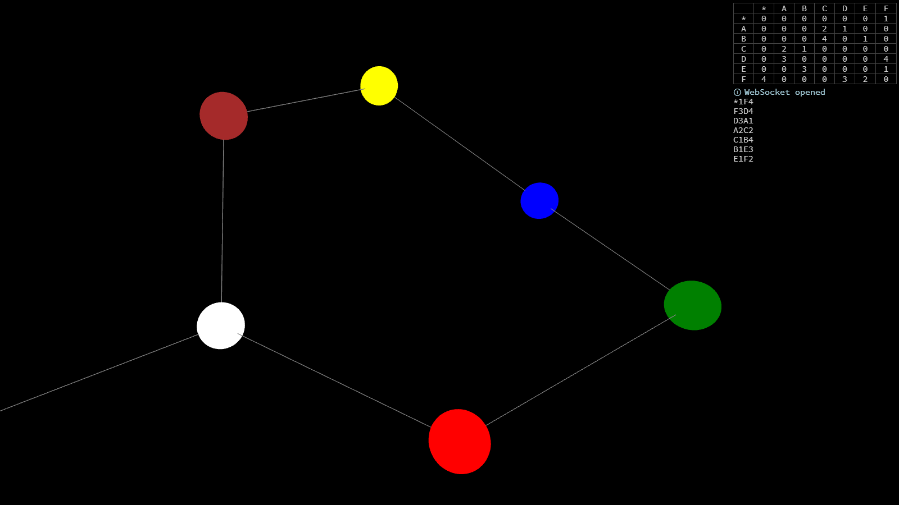

Introduction
============

Self aware network structure. It understands its own topology. Get started by
building the construction and running the software.

To get started:

1. Build nodes, edges, and the root node.

2. Program the root node and the nodes.

3. Connect the root node to the computer.

4. Start the web app.

License
=======

Except where noted otherwise, files are licensed under the WTFPL.

Copyright © 2018 [Felix E. Klee](felix.klee@inka.de)

This work is free. You can redistribute it and/or modify it under the terms of
the Do What The Fuck You Want To Public License, Version 2, as published by Sam
Hocevar. See the COPYING file for more details.
