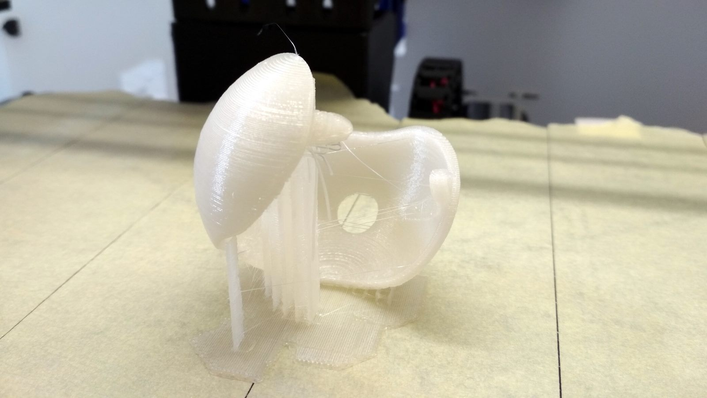
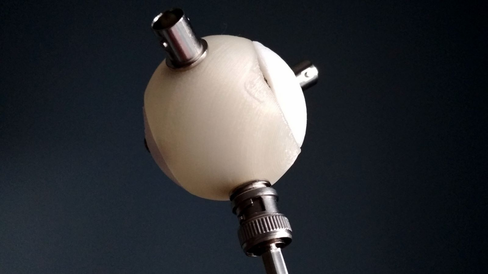
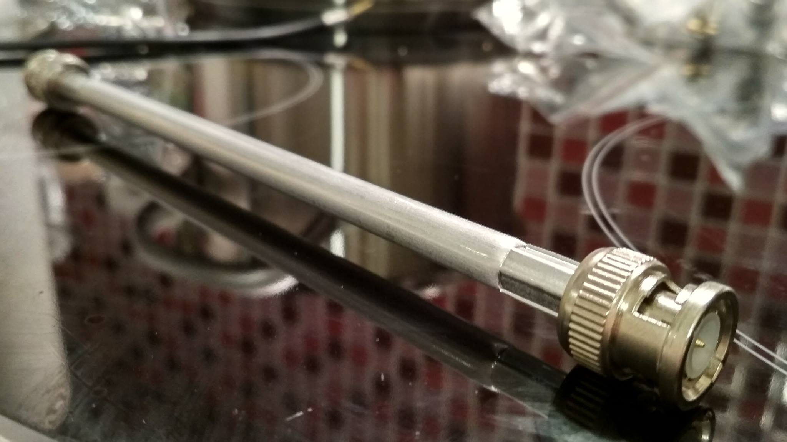

Introduction
============

Self aware network structure. It understands its own topology.

Nodes
-----

Nodes are 3D printed, composed of two parts:

Parametric design (Fusion 360): http://a360.co/2BTdbKg

Inside of each node there is a tiny microcontroller, a Digispark clone
(ATtiny85).

Edges
-----

Edges are composed of RG58 cables inside metal tubes, connected to BNC
connectors:

License
=======

Except where noted otherwise, files are licensed under the WTFPL.

Copyright © 2018 [Felix E. Klee](felix.klee@inka.de)

This work is free. You can redistribute it and/or modify it under the terms of
the Do What The Fuck You Want To Public License, Version 2, as published by Sam
Hocevar. See the COPYING file for more details.
