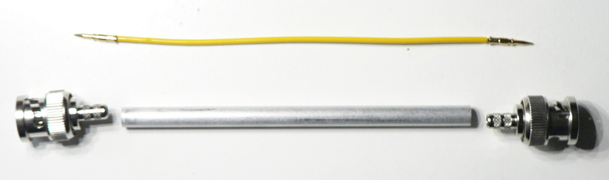
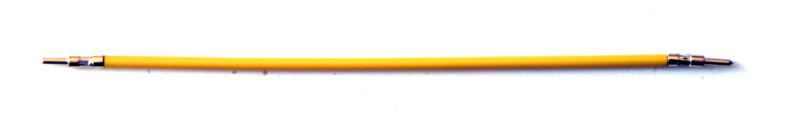
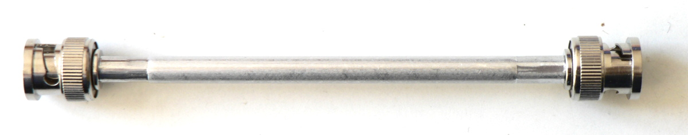

Parts
=====

  * 2 × RG58 BNC crimp coaxial connector with contact pins
  
  * Aluminum pipe, 6 mm outer diameter, 0.5 mm wall thickness, 100 mm length
  
  * 0.8 mm copper wire
  
  * ABS plastic pipe, 2.4 mm outer diameter, 1.2 mm inner diameter, 104 mm length

Steps
=====

 1. Crimp contact pins.
 
    

 2. Crimp pipe to fix connectors.
 
    
