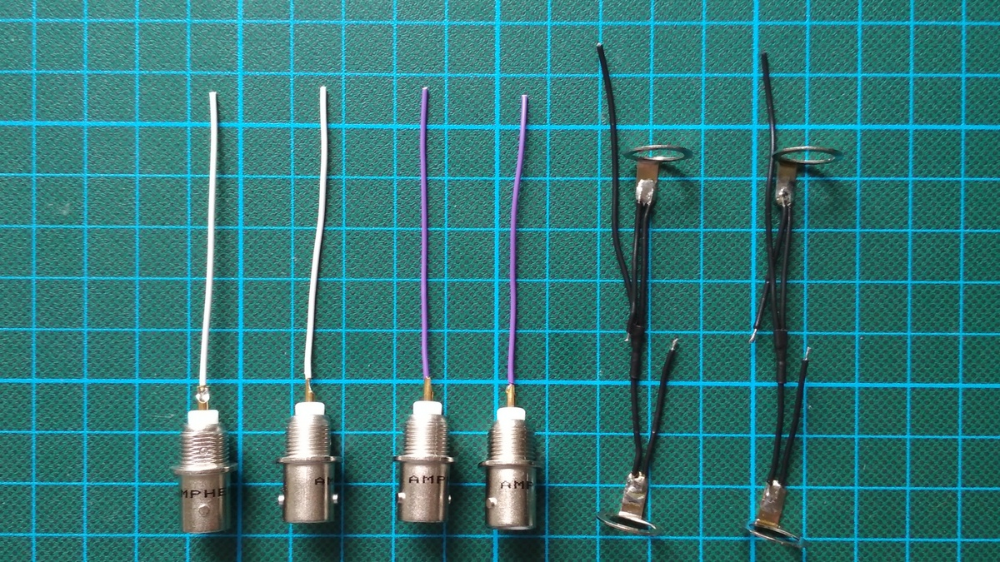
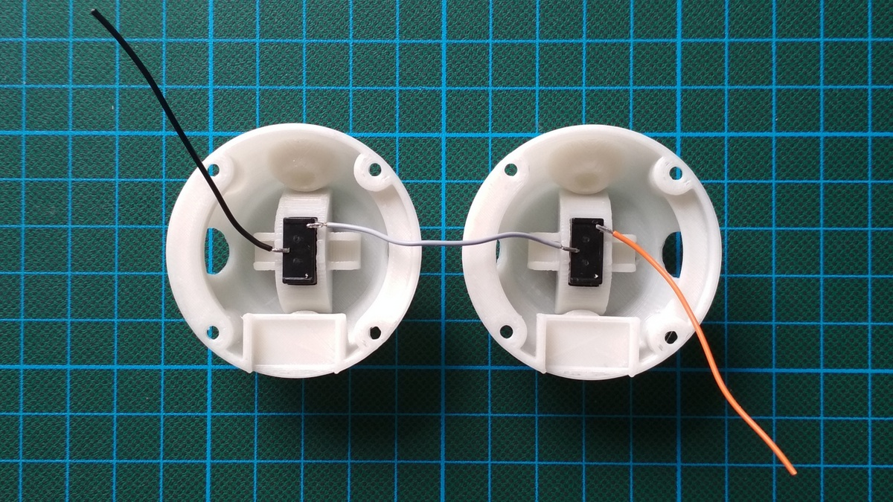

Parts
=====

  * Arduino Pro Mini

  * Flexible cables in different colors. Below we use: red, black, yellow,
    white, purple, orange, gray

    Size tested: 0.14 m² = 26 AWG (thinner cables could be easier to work with)

  * Heat shrink to accommodate two cables.

  * 4 × BNC connectors: Amphenol RF 31-221-RFX

  * 4 × LED: WS2811 F5 (5 mm short head)

  * 2 × vertical battery holder: KZH 20PCB-V

  * Glue for PLA plus PVC

  * Milky transparent plastics for 3D printing.

  * 4 × Screws: DIN 912, M2×5 mm

  * 4 × Nuts: DIN 934, M2
  
  * 6 pin header, stackable, i.e. with long pins

Assembly
========

 1. Hemisphere:

    

     1. 3D print two copies:

          - See the provided STL file.

          - Orient upside down.

          - Print without raft and support.

          - Print with high amount of infill to get smooth light from the LEDs.

     2. Cut material. Make sure that the LEDs fit into the receptacles.

     3. Sand the top of the print so that the hemispheres are flush when joined.

     4. Glue in battery holders using gap-filling glue, as pictured:
     
          - receptacle for 6 pin header on the left
          
          - ⊕ in front

 2. Cables:

    

     1. Cut:

          - black: 5 × 60 mm, 4 × 30 mm

          - red: 4 × 60 mm

          - yellow: 4 × 60 mm

          - purple, white: 2 × 60 mm (of each color)

          - gray, orange: 1 × 60 mm (of each color)

     2. Strip (2 mm) one end of:

          - yellow, orange: 1 × 60 mm (of each color)

          - red, purple, white: 2 × 60 mm (of each color)

          - black: 3 × 60 mm

     3. Strip both ends and the middle of:

          - red, black: 2 × 60 mm (of each color)

     4. Strip both ends of all remaining cables.

     5. Tin wires.

     6. Solder y-cables using the cables that are stripped in the middle plus
        the 60 mm cables that are stripped on just one end.

     7. Put heat shrink tube on connections of y-cables.

 3. BNC connectors:

    

     1. Bend solder tags by 90°.
     
     2. Test if bent BNC connectors fit in hemisphere.
     
     3. Tin solder tags.
     
     4. Solder one black y-cable and one short black cable onto each solder tag.
        Consistently always put the short cable on the same side.
     
     5. Tin the inside of the contact pins.
     
     6. Solder cables to the contact pins: white, purple

 4. LEDs:

    

     1. Test them using the provided Arduino sketch.

     2. Shorten pins of LEDs to 5 mm.
     
     3. Bend pins to spread them.
     
     4. Tin pins.

     5. Solder to first LED, from left to right:
     
          - (round side)

          - DIN: yellow cable, tinned on one end
          
          - VDD: black cable, short, attached to a BNC connector
          
          - VSS: red y-cable, one of the two tinned ends
          
          - DOUT: yellow cable
          
          - (flat side)

     6. Solder to second LED:
     
          - DIN: yellow cable, connected to DOUT on first LED
          
          - VDD: black cable, short, attached to the BNC connector which is
            connected to that from the previous step
          
          - VSS: red y-cable, connected to first LED
          
          - DOUT: yellow cable
          
      7. Solder to third LED:

          - DIN: yellow cable, connected to second LED
          
          - VDD: black cable, short, attached to BNC connector
          
          - VSS: red y-cable
          
          - DOUT: yellow cable
          
      8. Solder to fourth LED:

          - DIN: yellow cable, connected to third LED
          
          - VDD: black cable, short, attached to BNC connector
          
          - VSS: red y-cable

 5. Battery holders:

    

     1. Cut off one of each ⊕ connector pins completely.
     
     2. Tin pins.

     3. Solder to first battery holder:

          - ⊖: black cable

          - ⊕: gray cable

     4. Solder to second battery holder:

          - ⊖: gray cable, connected to first battery holder

          - ⊕: orange cable

     4. Bend pins flat.

 6. Pro Mini board:

     1. Desolder LED from Arduino Pro Mini (works good with a soldering iron and
        a little tin on its tip, as shown in the video “Desoldering led and
        voltage regulator on Arduino Pro
        Mini”: <https://www.youtube.com/watch?v=7qujkC72dYs>)

     2. Bend the six pin connector so that board with the connector fits into a
        hemisphere. Suggestion: Test by bending one pin first.

     3. Solder six piece connector to board.
     
     4. Thread white and purple cables through holes and metal rings:
     
          - First white cable: same side and hemisphere as the orange cable
          
          - First purple cable: same hemisphere as first purple cable
          
          - Second white cable: other hemisphere, next to the gray cable
          
          - Second white cable: remaining position
     
     5. Solder cables going into the bottom side of the board, after stripping
        ends:
     
          - GND between RST and RAW: two black cables, connected to battery
            holder and to LEDs three and four (see above)
            
          - Pin 10: white cable, going through hole in hemisphere, plus metal
            rings.
          
            […]
            
     6. Solder cables going into the upper side of the board, after stripping
        ends:
          
          - GND between RST and 2: remaining black cable
     
          - A0: yellow cable
          
          - VCC: both red cables

 7. Assemble.

 8. Test, in particular the LEDs.

 9. Glue the LEDs and the BNC connectors to the hemispheres.

10. Screw the hemispheres to create a sphere.

[1]: https://www.amazon.de/dp/B01BI1G88C/ref=cm_sw_em_r_mt_dp_U_CHrbBb90ZM0B4
