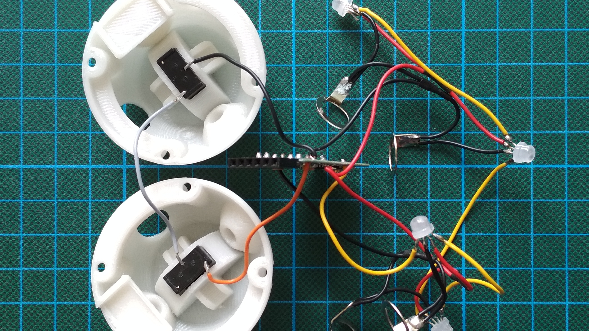
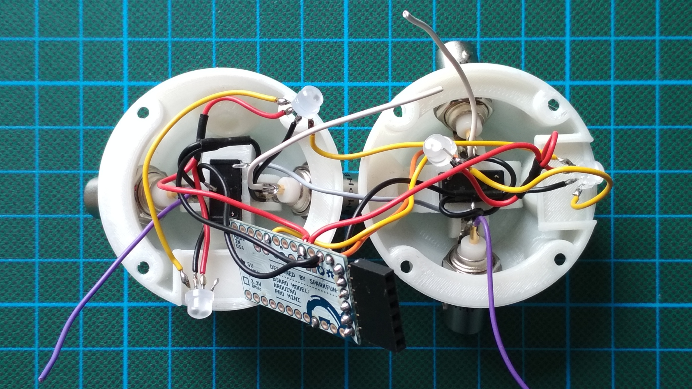
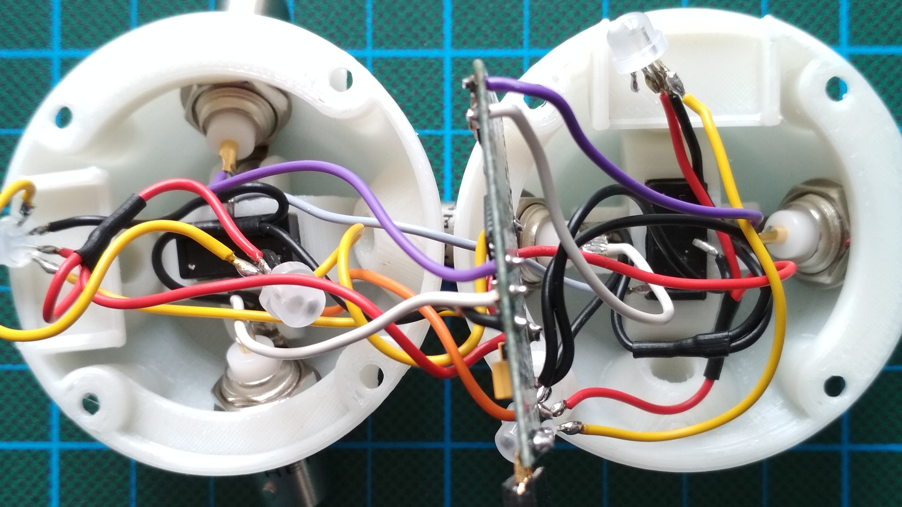
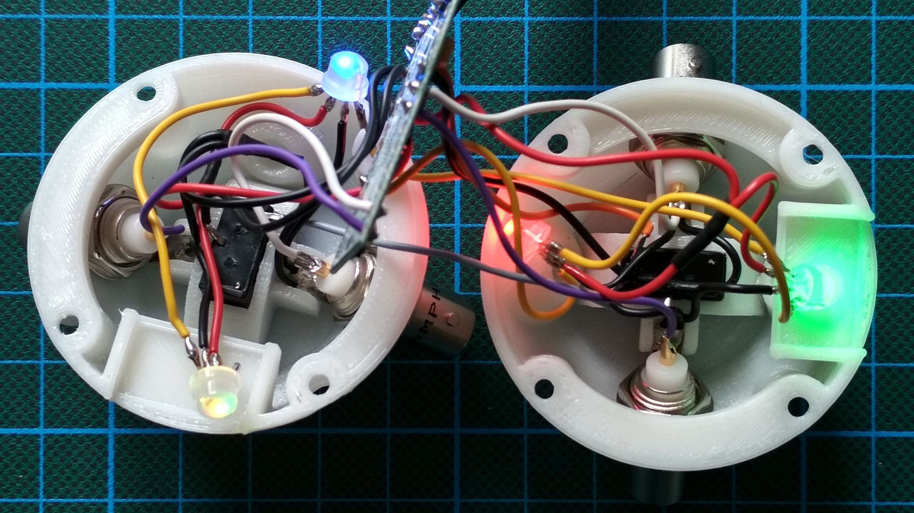
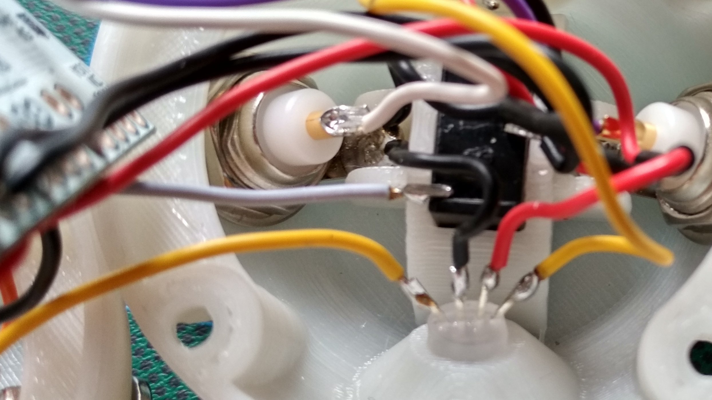
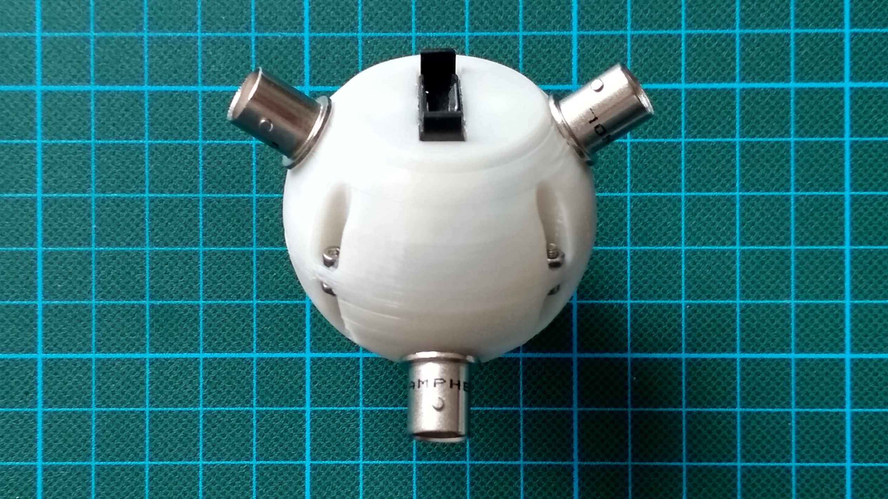

Parts
=====

  * Arduino Pro Mini

  * Flexible cables in different colors. Below we use: red, black, yellow,
    white, purple, orange, gray

    Size tested: 0.14 m² = 26 AWG (thinner cables could be easier to work with)

  * Heat shrink to accommodate two cables.

  * 4 × BNC connectors: Amphenol RF 31-221-RFX

  * 4 × LED: WS2811 F5 (5 mm short head)

  * 2 × vertical battery holder: KZH 20PCB-V

  * Glue for PLA plus PVC

  * Milky transparent plastics for 3D printing.

  * 4 × Screws: DIN 912, M2×5 mm

  * 4 × Nuts: DIN 934, M2

  * 6 pin header, stackable, i.e. with long pins

Assembly
========

 1. Hemispheres:

    

     1. 3D print two copies:

          - See the provided STL file: `hemisphere.stl`

          - Orient upside down.

          - Print without raft and support.

          - Print with high amount of infill to get smooth light from the LEDs.
          
        Optionally, you may print the hemisphere without receptacle
        for use as the bottom part (`hemisphere_optional_bottom.stl`).
        Functionally this is not necessary, however.

     2. Cut excess material. Make sure that the LEDs fit into the
        receptacles.

     3. Using P400 grid paper, wet sand the top of the print so that
        the hemispheres are flush when joined.

     4. Glue in battery holders using gap-filling glue, as pictured:

          - receptacle for 6 pin header on the left

          - ⊕ in front

 2. Cables:

    

     1. Cut:

          - black: 5 × 60 mm, 4 × 30 mm

          - red: 4 × 60 mm

          - yellow: 4 × 60 mm

          - purple, white: 2 × 60 mm (of each color)

          - gray, orange: 1 × 60 mm (of each color)

     2. Strip (2 mm) one end of:

          - yellow, orange: 1 × 60 mm (of each color)

          - red, purple, white: 2 × 60 mm (of each color)

          - black: 3 × 60 mm

     3. Strip both ends and the middle of:

          - red, black: 2 × 60 mm (of each color)

     4. Strip both ends of all remaining cables.

     5. Tin wires.

     6. Solder y-cables using the cables that are stripped in the middle plus
        the 60 mm cables that are stripped on just one end.

     7. Put heat shrink tube on connections of y-cables.

 3. BNC connectors:

    

     1. Bend solder tags by 90°.

     2. Test if bent solder tags fit in hemisphere.

     3. Tin solder tags.

     4. Solder one black y-cable and one short black cable onto each
        solder tag. Put the short cable on the left side, with the
        solder tag pointing towards you.

     5. Solder cables to the contact pins: white, purple

 4. LEDs:

    

     1. Test them using the provided Arduino sketch.

     2. Shorten pins of LEDs to 5 mm.

     3. Bend pins to spread them.

     4. Tin pins.

     5. Solder to first LED, from left to right:

          - (round side)

          - DIN: yellow cable, tinned on one end

          - VDD: black cable, short, attached to a BNC connector

          - VSS: red y-cable, one of the two tinned ends

          - DOUT: yellow cable

          - (flat side)

     6. Solder to second LED:

          - DIN: yellow cable, connected to DOUT on first LED

          - VDD: black cable, short, attached to the BNC connector which is
            connected to that from the previous step

          - VSS: red y-cable, connected to first LED

          - DOUT: yellow cable

      7. Solder to third LED:

          - DIN: yellow cable, connected to second LED

          - VDD: black cable, short, attached to BNC connector

          - VSS: red y-cable

          - DOUT: yellow cable

      8. Solder to fourth LED:

          - DIN: yellow cable, connected to third LED

          - VDD: black cable, short, attached to BNC connector

          - VSS: red y-cable

 5. Battery holders:

    

     1. Cut off one of each ⊕ connector pins completely.

     2. Tin pins.

     3. Solder to first battery holder:

          - ⊖: black cable

          - ⊕: gray cable

     4. Solder to second battery holder:

          - ⊖: gray cable, connected to first battery holder

          - ⊕: orange cable

     4. Bend pins flat.

 6. Arduino Pro Mini board:

    

     1. Desolder LED from Arduino Pro Mini (works good with a soldering iron and
        a little tin on its tip, as shown in the video “Desoldering led and
        voltage regulator on Arduino Pro
        Mini”: <https://www.youtube.com/watch?v=7qujkC72dYs>)

     2. Bend the six pin connector so that board with the connector fits into a
        hemisphere. Suggestion: Test by bending one pin first.

     3. Solder six piece connector to board.

     4. Solder cables into the upper side of the board, after stripping ends:

          - GND between RST and 2: remaining black cable

          - A0: yellow cable

          - VCC: both red cables

          - RAW: orange cable

     5. Solder cables into the bottom side of the board, after stripping ends:

          - GND between RST and RAW: two black cables, connected to battery
            holder and to LEDs three and four (see above)

 7. BNC connectors in sphere:

    

     1. Thread contact pin cables through holes in hemispheres:

          - First cable, white: same hemisphere and side as the orange cable

          - Second cable, purple: same hemisphere as the above white cable

          - Third cable, white: other hemisphere, next to the gray cable

          - Fourth cable, black: remaining position

     2. Screw onto each connector from the inside, but not super tight yet:

         1. lock washer

         2. solder tag: The solder tag for the first LED (see earlier step) goes
            with the first cable (see above), the solder tag for the second LED
            with the second cable, etc.

         3. hex nut

        It may be easier to first position the solder tag, then push the lock
        washer underneath, position the hex nut on top, and finally screw the
        connector through that.

 8. Contact pin cables on board:

    

      1. First and second cable (see earlier step) go into the upper side of the
         board:

          - Pin 2: white

          - Pin 3: purple

      2. Remaining cables go into the bottom side of the board:

          - Pin 8: white

          - Pin 9: purple

 9. LED positions:

    

      - Move each LED near the hole on the side of the solder tag where the
        black cable is soldered to.

      - Test the position of the LEDs using the provided sketch: red, green,
        blue, yellow

10. Glued parts:

    

      - Tighten the BNC connectors with the help of pliers and a female BNC
        connector.

      - Glue the LEDs into the respective holes.

      - Use a drop of glue to secure each BNC connector against rotation.

11. Sphere:

    

      - Positioning the board according to the direction that the cables go in.

      - The six pin header is held in place by the wide flange in one of the
        quadrants.

      - Use the M2 screws and nuts to hold the assembly together.

[1]: https://www.amazon.de/dp/B01BI1G88C/ref=cm_sw_em_r_mt_dp_U_CHrbBb90ZM0B4
