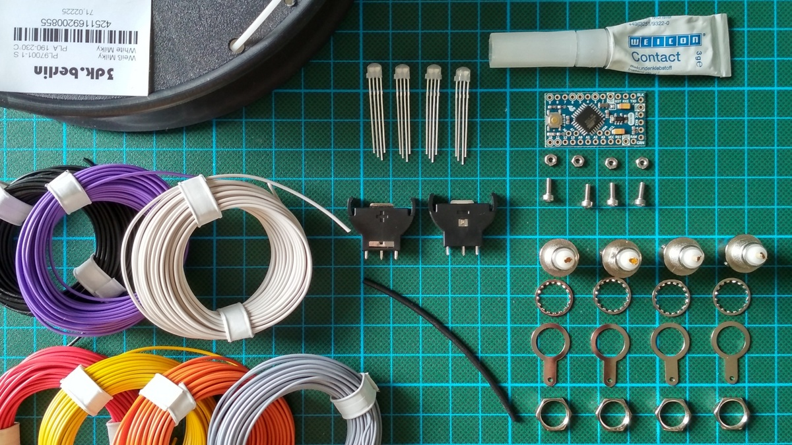
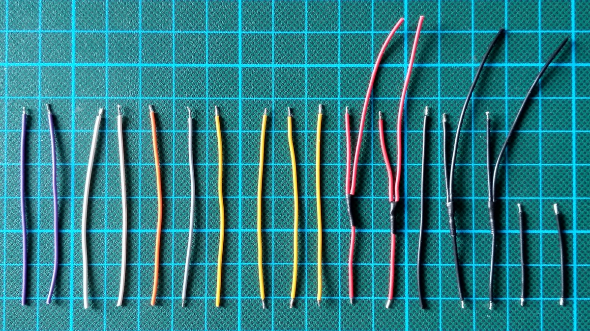

Parts
=====

  * Arduino Pro Mini

  * Flexible cables in different colors. Below we use: red, black, yellow,
    white, purple, orange, gray

    Size tested: 0.14 m² = 26 AWG (thinner cables could be easier to work with)

  * Heat shrink to accommodate two cables.

  * 4 × BNC connectors: Amphenol RF 31-221-RFX

  * 4 × LED: WS2811 F5 (5 mm short head)

  * 2 × vertical battery holder: KZH 20PCB-V

  * Glue for PLA plus PVC

  * Milky transparent plastics for 3D printing.

  * 4 × Screws: DIN 912, M2×6

  * 4 × Nuts: DIN 934, M2

Assembly
========

 1. Hemisphere:

    

     1. 3D print two copies:

          + See the provided STL file.

          + Orient upside down.

          + Print without raft and support.

          + Print with high amount of infill.

     2. Cut material. Make sure that the LEDs fit into the receptacles.

     3. Sand the top of the print so that the hemispheres are flush when joined.

     4. Glue in battery holders using gap-filling glue.

 2. Cables:

    

     1. Cut:

          - black: 5 × 60 mm, 2 × 30 mm

          - red: 4 × 60 mm

          - yellow: 4 × 60 mm

          - purple, white: 2 × 60 mm (of each color)

          - gray, orange: 1 × 60 mm (of each color)

     2. Strip (2 mm) one end of:

          - yellow, orange: 1 × 60 mm (of each color)

          - red, purple, white: 2 × 60 mm (of each color)

          - black: 3 × 60 mm

     3. Strip both ends and the middle of:

          - red, black: 2 × 60 mm (of each color)

     4. Strip both ends of all remaining cables.

     5. Tin wires.

     6. Solder y-cables using the cables that are stripped in the middle plus
        the 60 mm cables that are stripped on just one end.

     7. Put heat shrink tube on connections of y-cables.

 3. BNC connectors:

     1. Bend BNC connector solder tags by 90°, then solder one y black and one
        short black one onto each.

     2. Solder wires to center pins: white, purple

 4. LEDs:

     1. Test them. (provide sketch)

     2. Shorten pins of LEDs to 5 mm.

     3. Solder stuff to LEDs.

 5. Battery holders:

     1. Cut off one of each + connector pins completely.

     2. Shorten pins to half their length.

     3. Solder cables to battery holders.

     4. Bend pins to flatten holders.

 6. Assemble.

 7. Pro Mini board:

     1. Desolder LED from Arduino Pro Mini (works good with soldering iron, as
        shown in the video “Desoldering led and voltage regulator on Arduino Pro
        Mini”: <https://www.youtube.com/watch?v=7qujkC72dYs>)

     2. Bend the six piece connector so that the distance to the FTDI is minimized.

     3. Solder six piece connector.

     4. Solder everything to the board, stripping cables where needed.

 8. Test, in particular the LEDs.

 9. Glue the LEDs and the BNC connectors to the hemispheres.

10. Screw the hemispheres to create a sphere.

[1]: https://www.amazon.de/dp/B01BI1G88C/ref=cm_sw_em_r_mt_dp_U_CHrbBb90ZM0B4
