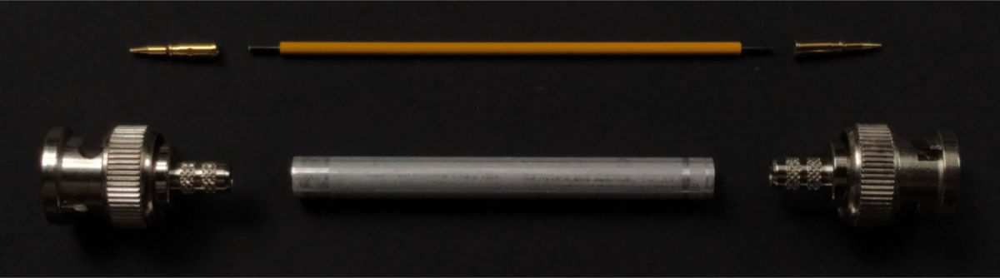

Introduction
============

Edges are composed of RG58 cables inside metal tubes, connected to BNC
connectors.

Parts
=====

  * 2 × RG58 BNC crimp coaxial connector with contact pins: Amphenol RF 112116

  * Aluminum pipe, 6 mm outer diameter, 0.5 mm wall thickness, 60 mm length

  * ABS coated wire, 1.0 mm wire diameter, 1.6 mm outer diameter:
    [Modulor Item #4500359-002-ST][1]

    Isolation cut to a length of 66 mm

Consider adding a resistor as a protection against shorting when nodes are
connected in loops: [Half Duplex: How to prevent shorting?][2] (Electrical
Engineering StackExchange)

Assembly
========

 1. Scrape off oxide layer from stripped wires.

 2. Crimp contact pins.

 3. Assemble. The contact pins require some force to click into the connectors.

 4. Crimp pipe to fix connectors.

    

[1]: https://www.modulor.de/en/abs-round-tube-opaque-coloured-oe-1-6-l-760-mm-wire-yellow.html
[2]: https://electronics.stackexchange.com/q/368116/21817
