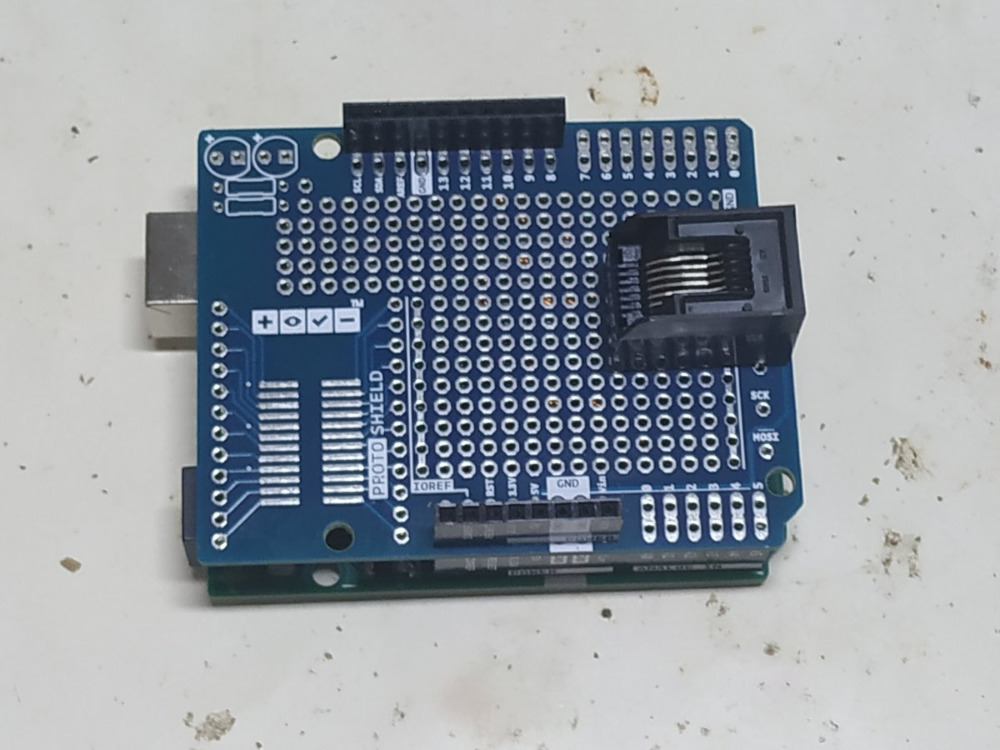
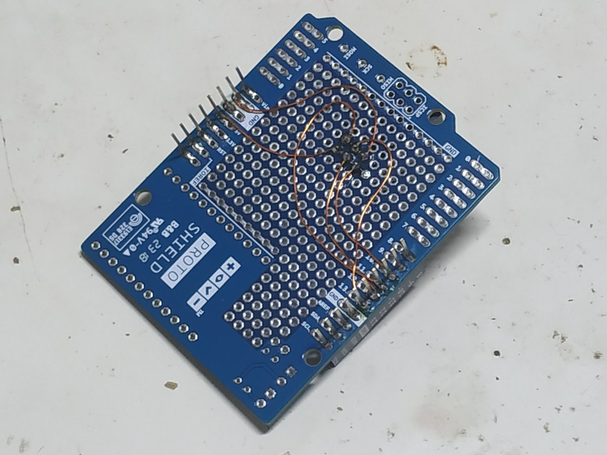

Introduction
============

The node PCB simplifies assembly compared to assembly from a multitude of
individual components connected to an Arduino Pro Mini board.

Most components can be found in Seeed Studio’s [OPL][1], the Open Parts Library.

Additional components
=====================

For programming:

  * Tag-Connect cable without legs (NL = no legs): TC2030-IDC-NL
  
  * Tag-Connect retaining clip: ‎[TC2030-CLIP-ND‎][3]
  
  * Mini-USB cable with loose ends
  
  * FTDI 5V TTL-232R USB – TTL level serial converter: [TTL-232R-5V-WE][7]
  
  * Heat-shrink tubing: for assembling the FTDI-to-Mini-USB cable

For each node (not part of PCBA):
  
  * FFC, 0.5mm, 6 pos: [Molex 0151660051][8]
  
  * 4 × programmable RGB LED: WS2812D-F5
  
  * 2 × CR2032 SMD battery holder: [BK-912][4]
  
  * 4 × BNC connector: [31-221-RFX][5]
  
  * 4 × PicoBlade cable: [Alibaba][6]
  
  * 2 × CR2032
  
  * ADXL337 (optional, hard to solder)
  
  * 4 × screw: DIN 912, M2×5 mm
  
  * 4 × nut: DIN 934, M2

Burning the boot loader to the PCB
==================================

To burn the bootloader onto the 328P:

  * Mount the shield onto an Arduino Uno.
  
  * Use the Tag-Connect cable to connect the shield and the PCB.
  
  * Use the `ArduinoISP` sketch (in examples distributed with the Arduino 1.8.8
    IDE) to burn the boot loader to the PCB.

Reading
=======

[SAN: PCB Design][2]

[1]: https://www.seeedstudio.com/opl.html
[2]: https://feklee.github.io/san/notes/db95a440-7520-4fa2-a001-c076d31a4e77/
[3]: https://www.digikey.de/short/pjm9zh
[4]: https://www.digikey.de/short/pjm9pw
[5]: https://www.digikey.de/short/pjm9pm
[6]: https://www.alibaba.com/product-detail/molex-picoblade-51021-1-25mm-pitch_60690837931.html
[7]: https://www.digikey.de/short/pjmbpr
[8]: https://www.digikey.de/short/pjmbw3
